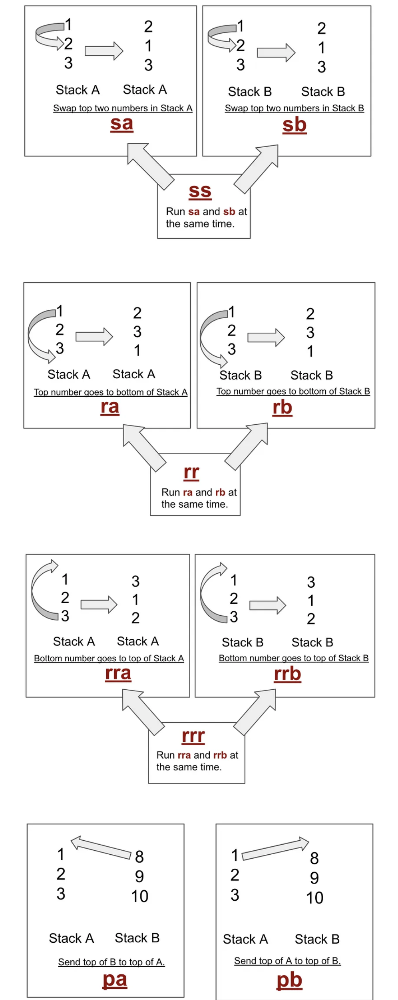

# push_swap
 
This project involves sorting data on a stack, with a limited set of instructions, and the smallest number of moves. To make this happen, you will have to manipulate various sorting algorithms and choose the most appropriate solution(s) for optimized data sorting.

• The goal is to sort in ascending order numbers into stack a. To do so you have the
following operations at your disposal:

## 3 random numbers:
We have 5 possible cases for only three random numbers being put into Stack A. All I did is an if condition for every case (pretty lazy huh !?). I compare the first with the middel and the last, And the middel with the last.
## 5 random numbers:
To be able to use the algo of the 3 numbers I push to stack B the tow minimum, After that I push back to stack A.
## 100 and 500 random numbers:
I use the range algorithme which basically seting every number with in index from the low to the higher value than as long as stack A is full check if index of the stack's top it's in the range (for example range = 15 => start = 0 and end = 15) if true push to B and shift the range ( start +1 and end +1 ). if the index of the stack's top is less than the range we push to B and we rotate b, Else we cheak if the minimum is the tail of the stack A we reverse rotate stack A else just rotate stack A. Now stack A is empty and stack B is sorted like a sand clock at the top and the bottom the highest value and at the middel the lowest value, To push back to stack A we search for the max if it's close from the top we rotate if it's close form the bottom we revers rotate, than we push to A. that is it 

https://github.com/ism417/push_swap/assets/153442539/4c014dca-d8b2-493f-bd2b-2c541c0aab60

